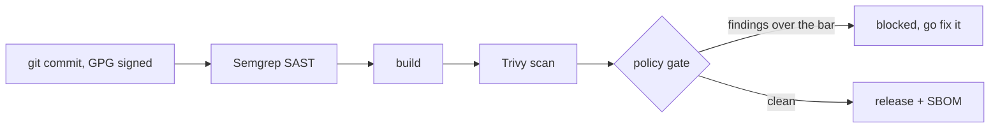

```console
$ whoami
mark read

$ cat /etc/motd
Security engineering @ ArangoDB. I secure the software supply chain.
```

I write the scanning policy, build the CI gates that enforce it, and fix what they catch. Most of my public activity is CVE remediation and hardening PRs across the [arangodb](https://github.com/arangodb) and arangoml orgs: 86 PRs, 20+ repos, roughly 200 contributions in the last year. Blue team and DFIR background. Homelab that gets patched more promptly than it deserves.

## What I do

- Rolled out container and filesystem CVE scanning (Trivy) and SAST (Semgrep) as shared CircleCI orbs across ArangoDB's repos, and wrote the policy that decides what blocks a build
- CVE remediation across the fleet: [arangodb/arangodb](https://github.com/arangodb/arangodb), [kube-arangodb](https://github.com/arangodb/kube-arangodb), [go-driver](https://github.com/arangodb/go-driver), the [oskar](https://github.com/arangodb/oskar) build system, arangosync, and a long tail of arangoml services
- GitHub org hardening at enterprise scale: branch protection rulesets, GPG commit signing, least-privilege access, offboarding
- Secrets management with Vault and 1Password, release pipeline security, SBOM work, incident response when the above fails

The shape of it:



Gates stay narrow and blocking, reporting stays wide. A gate nobody can live with gets waived into meaninglessness, so I'd rather block on five things reliably than on fifty things theoretically.

## Projects

| Repo | What it is |
| --- | --- |
| [wireguard-pa440-vpn-guide](https://github.com/MarkusReadius/wireguard-pa440-vpn-guide) | Enterprise site-to-site WireGuard, hub and spoke across Palo Alto PA-440s and ESXi, diagrams included |
| [MAR](https://github.com/MarkusReadius/MAR) | Hardened Docker suite behind Traefik: Pi-hole, Mattermost, CryptPad and friends, with automated backups and health monitoring |
| [ReadIsRight-Homelab](https://github.com/MarkusReadius/ReadIsRight-Homelab) | The homelab, written down in Terraform so I stop rebuilding it from memory |
| [ta-volatility](https://github.com/MarkusReadius/ta-volatility) | Fork of the Splunk add-on that ingests Volatility memory forensics output, from my DFIR days |
| [vidleech](https://github.com/MarkusReadius/vidleech) | Python GUI video downloader on top of yt-dlp. MIT, CI-built |
| [Mamochka](https://github.com/MarkusReadius/Mamochka) | Subscription and P&L tracker in JavaScript |
| [git-guide](https://github.com/MarkusReadius/git-guide) | The Git guide I wish someone had handed me when I started |

## Tools I actually use

Trivy, Semgrep, Docker, Kubernetes, Terraform, Ansible, CircleCI, GitHub Actions, GCP, HashiCorp Vault, WireGuard, Palo Alto, Splunk, Volatility, Git and GPG. Python and Bash daily, JavaScript when needed, some Go. Linux and ESXi underneath.

<br/>

<div align="center">

<picture>
  <source media="(prefers-color-scheme: dark)" srcset="https://github-readme-activity-graph.vercel.app/graph?username=MarkusReadius&theme=tokyo-night&hide_border=true&area=true" />
  
</picture>

<br/><br/>

<picture>
  <source media="(prefers-color-scheme: dark)" srcset="https://raw.githubusercontent.com/MarkusReadius/MarkusReadius/output/github-snake-dark.svg" />
  <source media="(prefers-color-scheme: light)" srcset="https://raw.githubusercontent.com/MarkusReadius/MarkusReadius/output/github-snake.svg" />
  
</picture>

<br/><br/>

If something here saved you an afternoon:

<br/><br/>

<a href="https://www.buymeacoffee.com/markusreadius"></a>
&nbsp;


</div>
